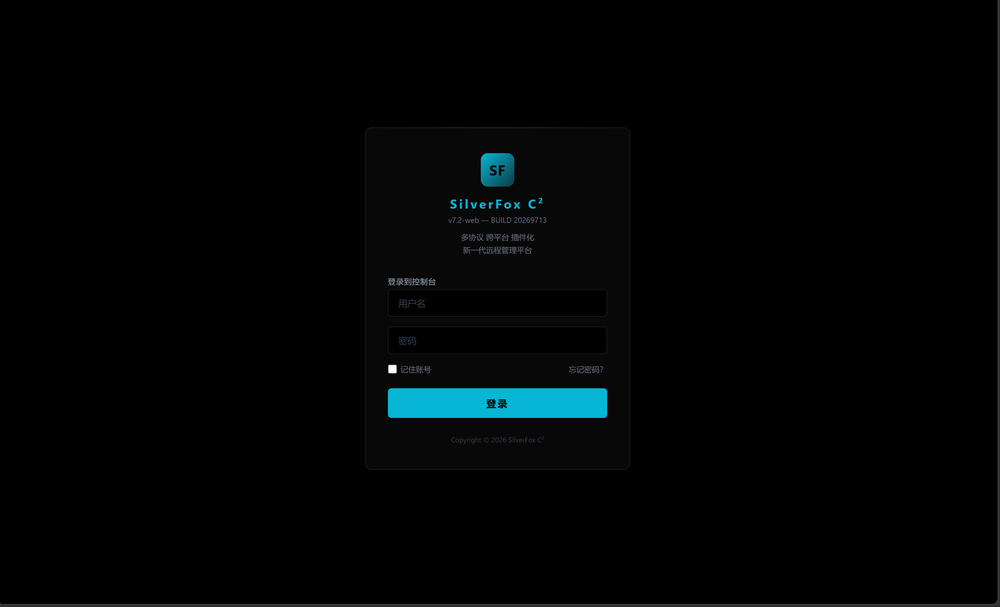
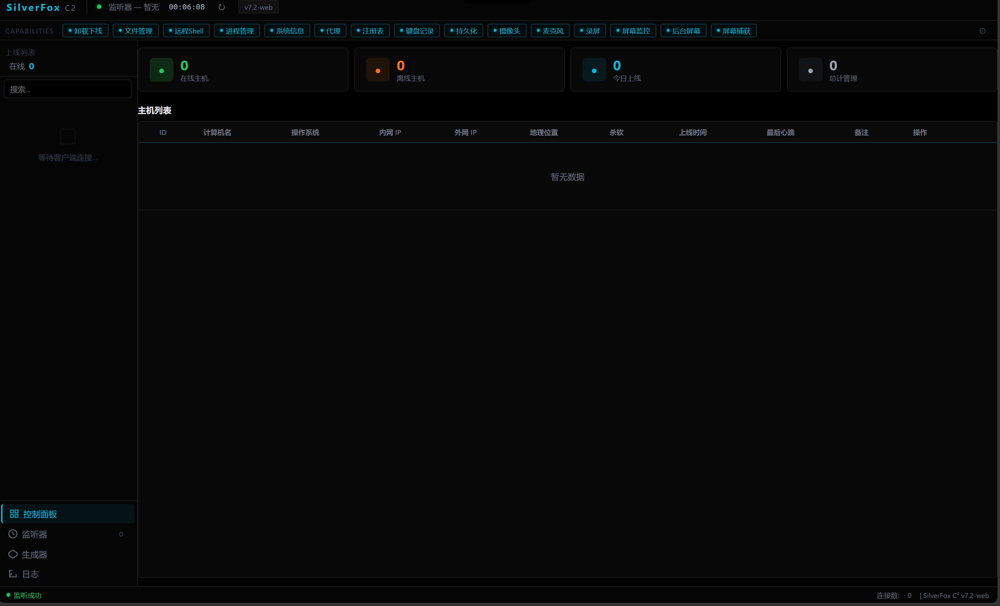

# SilverFox C²

  <strong>多协议 · 跨平台 · 插件化</strong> 
  面向授权安全测试的新一代 C2 平台

---

## 召集大佬

> **一个人写不完，找大佬一起搞。** 服务端骨架有了，C 客户端通信链路也跑通了，剩下的全是硬骨头——插件系统、Shell 交互、免杀对抗、流量伪装。一个人肝不动，来几个能打的。

| 方向 | 要什么水平 | 干什么活 |
|------|-----------|---------|
| **Go 服务端** | 熟悉 Go、TCP/TLS、并发 | 多协议监听器、插件系统、任务队列 |
| **C 客户端** | 玩过 Win32、Socket | Shell 交互、文件传输、进程管理、持久化 |
| **Web 前端** | 原生 JS 能打 | 控制台功能对接、数据可视化 |
| **安全研究** | 免杀、协议混淆、密码学 | 通信加密增强、流量伪装、规避技术 |

**怎么加入：** 私信我（Telegram 或 Email），聊一下你擅长的方向，拉你进开发团队。

---

## 功能

### 已完成

- 基于 Go 的高性能服务端，TLS 加密通信
- 客户端心跳检测、密钥协商与超时自动剔除
- C 语言客户端框架，核心通信链路可用
- Web 管理面板基础骨架（登录页 + 控制台 UI）

### 待协作补齐

- 多协议监听器架构
- 插件化模块系统
- 控制台功能逻辑对接
- 客户端功能实现（Shell 交互、文件传输、进程管理、持久化等）
- 客户端平台扩展（Linux / macOS）

---

## 截图

  <strong>登录页</strong>

  <strong>控制台主界面</strong>

---

## 免责声明

> **免责声明** — 本项目仅限授权安全测试、红队演练及教育研究用途。使用者须遵守所在地法律法规，任何滥用行为与作者无关。
>
> *This project is intended solely for authorized security testing, red team engagements, and educational purposes. Users are responsible for complying with all applicable laws. The authors assume no liability for misuse.*

---

## 联系方式

- **GitHub Issues / Discussions** — 提交 Bug、功能建议或参与讨论
- **Telegram** — [@hello_world_7](https://t.me/hello_world_7)
- **Email** — [barnesnicole255@gmail.com](mailto:barnesnicole255@gmail.com)
